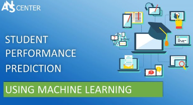
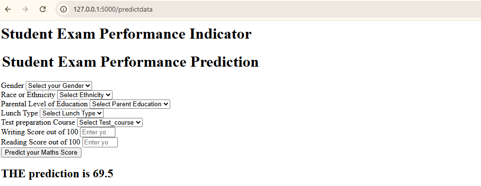

# Student Math Score Prediction using ML :

This project aims to predict students' math scores based on various features such as their study hours and previous test performance. The goal is to use machine learning models to develop a predictive model that can help educators and students identify potential performance issues and tailor learning strategies accordingly. The problem we are addressing is the lack of personalized prediction tools for student performance in the educational sector.

<p align="center">
  
</p>

---

## Table of Contents :

- [Project Overview](#project-overview)
- [Dataset Description](#dataset-description)
- [Project Files Structure](#project-files-structure)
- [Machine Learning Models Used](#machine-learning-models-used)
- [Model Evaluation](#model-evaluation)
- [Installation](#installation)
- [Usage](#usage-)


---

## Project Overview :

#### Problem Statment :

Despite the growing emphasis on personalized learning, many educational institutions still lack data-driven tools to effectively predict student academic performance—particularly in mathematics, a subject that often poses challenges for learners. Without early intervention, struggling students may continue to fall behind, missing opportunities for timely support. By leveraging machine learning, we aim to bridge this gap by creating predictive models that can help identify at-risk students early on, enabling educators to take proactive measures and enhance learning outcomes.

#### Proposed Solution :

We will build a **machine learning model that predicts students math scores** based on available features such as study time, previous scores, and other relevant factors. This prediction can be used as a decision-making tool for teachers and educational planners to allocate resources and interventions where they are most needed.

---

## Dataset Description :

The dataset used for this analysis is the **Student performance prediction** dataset from Kaggle. The dataset contains the following columns :

• **Gender** : The gender of the student (male/female)

• **Race/ethnicity** : The student's racial or ethnic background (Asian, African-American, Hispanic, etc.)

• **Parental level of education** : The highest level of education attained by the student's parent(s) or guardian(s)

• **Lunch** : Whether the student receives free or reduced-price lunch (yes/no)

• **Test preparation course** : Whether the student completed a test preparation course (yes/no)

• **Math score** : The student's score on a standardized mathematics test

• **Reading score** : The student's score on a standardized reading test

• **Writing score**: The student's score on a standardized writing test

---

## Project files structure :


```bash
ML-project/
|
├── artifacts/
│   └── model.pkl 
|   └── preprocessor.pkl 
|   └── raw.csv 
|   └── test.csv
|   └── train.csv
|
├── catboost_info/
│   └── <files>
|
├── notebook/
│   └── data/ 
|        └── <file.csv>
|   └── EDA_student_performance.ipynb
|   └── Model_trainer.ipynb 
|
|
├── src/
│   └── components/
|         └── __init__.py
|         └── data_ingestion.py
|         └── data_transformation.py
|         └── model_trainer.py
|   └── pipeline/ 
|         └── __init__.py
|         └── predict_pipeline.py
|         └── train_pipeline.py
|   └── __init__.py 
|   └── exception.py
|   └── logger.py
|   └── utils.py
| 
├── templates/
│   └── home.html
|   └── index.html 
|
├── .gitignore
|
├── README.md
|
├── app.py
|
├── requirements.txt
|
└── setup.py
```


---

##  Machine Learning Models Used

To accurately predict students' math scores based on key features such as study time and prior test performance, we implemented and compared a variety of regression models. These models were selected to balance simplicity, interpretability, and predictive power. Below is the list of models explored in this project:

- **Linear Regression** – A baseline model to establish a simple linear relationship between the input features and the target variable.
- **Lasso Regression** – A linear model with L1 regularization to prevent overfitting and perform feature selection.
- **Ridge Regression** – A linear model with L2 regularization that helps manage multicollinearity and improves generalization.
- **K-Neighbors Regressor** – A non-parametric model that predicts based on the average of nearest neighbors in the training set.
- **Decision Tree Regressor** – A tree-based model that splits data into regions based on feature thresholds.
- **Random Forest Regressor** – An ensemble of decision trees that reduces overfitting and improves prediction accuracy.
- **XGBoost Regressor** – A powerful gradient boosting algorithm known for high performance on structured/tabular data.
- **CatBoost Regressor** – A gradient boosting model optimized for categorical data, offering fast and accurate predictions with minimal preprocessing.
- **AdaBoost Regressor** – An adaptive boosting model that combines multiple weak learners into a strong predictive model.

---

## Model Evaluation :

After training the models, we evaluated their performance on both the training and testing datasets using the following metrics:

- **RMSE (Root Mean Squared Error)**: Measures the average magnitude of the errors.
- **MAE (Mean Absolute Error)**: Captures the average absolute difference between predicted and actual values.
- **R² Score**: Indicates how well the model explains the variability of the target variable.

The table below summarizes the results:


| Model Name               | Train MAE | Train RMSE | Train R² | Test MAE | Test RMSE | Test R² |
|--------------------------|-----------|------------|----------|----------|-----------|---------|
| Ridge                    | 4.264988  | 5.323325   | 0.874304 | 4.211101 | 5.390387  | 0.880593 |
| Linear Regression        | 4.272266  | 5.340184   | 0.873507 | 4.225313 | 5.421372  | 0.879216 |
| CatBoosting Regressor    | 2.405394  | 3.042664   | 0.958936 | 4.612532 | 6.008632  | 0.851632 |
| Random Forest Regressor  | 1.820527  | 2.263569   | 0.977273 | 4.649220 | 6.030875  | 0.850531 |
| AdaBoost Regressor       | 4.749230  | 5.797062   | 0.850937 | 4.740921 | 6.041307  | 0.850014 |
| XGBRegressor             | 0.687467  | 1.007282   | 0.995500 | 5.057731 | 6.473307  | 0.827797 |
| Lasso                    | 5.206303  | 6.593816   | 0.807146 | 5.157882 | 6.519695  | 0.825320 |
| K-Neighbors Regressor    | 4.517500  | 5.709063   | 0.855428 | 5.637000 | 7.258333  | 0.783497 |
| Decision Tree            | 0.018750  | 0.279508   | 0.999653 | 6.315000 | 7.788774  | 0.750697 |

#### Chosen Model :

We chose **Linear Regression** for this project because of its simplicity, ease of interpretation, and effectiveness in modeling linear relationships. It provides a clear, quantitative understanding of how individual features influence the predicted math scores. Linear Regression also serves as a strong baseline, making it easier to compare with more complex models. Its relatively low computational cost and transparency make it ideal for educational settings, where clear decision-making is essential.

---

## Installation :

---

## Usage :

Once the app is running, the user can:

1. Enter data for the number of study hours and previous test scores.
    
2. Click "Predict" to get the predicted math score.
    
3. Use this prediction as a potential indicator of future performance.

<p align="center">
  
</p>


